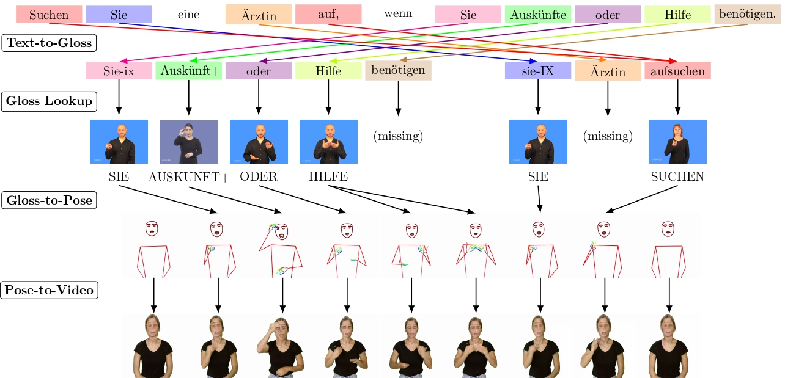

# English-to-ASL Rules Pipeline

This project translates **English text** into an **ASL-oriented gloss sequence** and then converts that gloss sequence into a **skeletal pose animation**.

It is no longer a general multilingual research fork. The codebase is intentionally narrowed to a single path:

- Input: English
- Output sign language: American Sign Language (`ase`)
- Glosser strategy: rule-based only



## What This Project Does

The pipeline has three stages:

1. **English text to ASL-style gloss**
   The rule engine rewrites English into a gloss sequence that is closer to ASL structure than plain English word order.

2. **Gloss to pose**
   Each gloss is matched against a pose lexicon. If a word is missing from the lexicon, the system can fall back to ASL fingerspelling.

3. **Pose to video**
   The generated pose sequence can optionally be rendered into a video if you install the external `pose-to-video` package.

## Project Scope

This repository is intentionally constrained.

- Only English input is supported.
- Only ASL output is supported.
- Only the `rules` glosser exists.
- The bundled English demo lexicon is minimal and is mainly useful for smoke tests and UI demos.
- Unknown English words usually resolve through the bundled ASL fingerspelling poses.

## How The Rules Work

The text-to-gloss logic lives in [spoken_to_signed/text_to_gloss/rules.py](spoken_to_signed/text_to_gloss/rules.py).

The current rule set is designed to produce a practical ASL-oriented gloss approximation, not a full linguistic model of ASL. The main transformations are:

- front explicit time expressions,
- drop English articles and filler words,
- keep useful determiners such as `MY`, `YOUR`, `THIS`, `THAT`,
- move adjectives and numbers after nouns where appropriate,
- move modal verbs after the main lexical content,
- push manual negation toward clause-final position,
- push WH terms toward clause-final position,
- drop copular `be` when it only links to an adjectival or nominal predicate.

This gives you a deterministic and debuggable gloss pipeline that is easier to control than a model-driven translator.

## Repository Layout

- [app.py](app.py)  
  Streamlit demo UI for entering English text, previewing glosses, and rendering the pose animation.

- [spoken_to_signed/text_to_gloss/rules.py](spoken_to_signed/text_to_gloss/rules.py)  
  English-to-ASL rule engine.

- [spoken_to_signed/gloss_to_pose](spoken_to_signed/gloss_to_pose)  
  Gloss lookup, pose concatenation, smoothing, and fingerspelling fallback.

- [assets/dummy_lexicon_en](assets/dummy_lexicon_en)  
  Tiny bundled English demo lexicon.

- [spoken_to_signed/assets/fingerspelling_lexicon/ase](spoken_to_signed/assets/fingerspelling_lexicon/ase)  
  ASL fingerspelling pose assets used as fallback.

## Installation

Use a virtual environment and install the project in editable mode:

```bash
python3 -m venv .venv
source .venv/bin/activate
pip install -e .
```

The rules pipeline uses spaCy. If the English model is not installed, the loader may attempt to download `en_core_web_sm` automatically the first time you run it.

## Command Line Usage

### Text to gloss

```bash
text_to_gloss \
  --text "Tomorrow my big dog can go."
```

### Text to gloss to pose

```bash
text_to_gloss_to_pose \
  --text "Children eat pizza." \
  --lexicon "assets/dummy_lexicon_en" \
  --pose "quick_test.pose"
```

### Text to gloss to pose to video

Video generation is optional and requires an extra package:

```bash
pip install 'pose-to-video[pix2pix,simple_upscaler] @ git+https://github.com/sign-language-processing/pose-to-video'
```

Then run:

```bash
text_to_gloss_to_pose_to_video \
  --text "Children eat pizza." \
  --lexicon "assets/dummy_lexicon_en" \
  --video "quick_test.mp4"
```

## Streamlit App

Run the demo UI with:

```bash
streamlit run app.py
```

The app is fixed to the only supported configuration:

- English input
- ASL output
- rule-based glossing

It will display:

- the generated gloss sequence,
- a skeletal animation preview,
- downloadable `.pose` and `.gif` outputs.

## Notes About The Bundled Lexicon

The included English lexicon is intentionally small. It is there to keep the repository lightweight and to provide a predictable demo path.

In practice:

- known demo entries resolve directly through `assets/dummy_lexicon_en`,
- many ordinary words will fall back to fingerspelling,
- a production-quality system will need a much larger ASL lexicon.

## Testing

The focused test suite for the current repo is:

```bash
python3 -m pytest tests/test_english_rules.py tests/test_e2e.py
```

These tests cover:

- rule ordering behavior,
- English-to-pose generation with the bundled demo lexicon,
- fingerspelling fallback behavior.

## Upstream Context

This repository started from a broader spoken-to-signed research codebase associated with the paper below, but the current code has been simplified to a single English-to-ASL rules-based workflow.

Paper: [An Open-Source Gloss-Based Baseline for Spoken to Signed Language Translation](https://arxiv.org/abs/2305.17714)

## Citation

If the upstream research is relevant to your use case, cite:

```bib
@inproceedings{moryossef2023baseline,
  title={An Open-Source Gloss-Based Baseline for Spoken to Signed Language Translation},
  author={Moryossef, Amit and M{\"u}ller, Mathias and G{\"o}hring, Anne and Jiang, Zifan and Goldberg, Yoav and Ebling, Sarah},
  booktitle={2nd International Workshop on Automatic Translation for Signed and Spoken Languages (AT4SSL)},
  year={2023},
  month={June},
  url={https://github.com/ZurichNLP/spoken-to-signed-translation},
  note={Available at: \url{https://arxiv.org/abs/2305.17714}}
}
```
